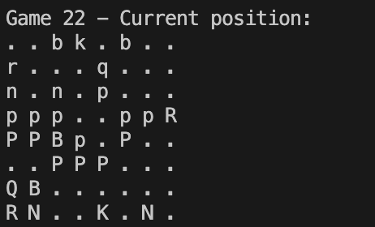
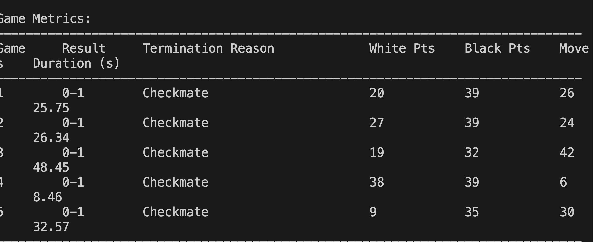

## High-Level Overview

The provided repository appears to be a cognitive reinforcement learning project focused on chess, utilizing the Stockfish API and the Monte Carlo Tree Search (MCTS) algorithm. The project consists of four Python files: `rl_stockfish.py`, `game.py`, `stockfish.py`, and `chess_game.py`.

<p align="center">
  
</p>

## Module Descriptions

- **`rl_stockfish.py`**  
  This module implements the MCTS algorithm, including move encoding and decoding, and a basic MCTS node structure. It also contains code for simulating games and evaluating board positions.


- **`game.py`**  
  This module provides an interface to the Stockfish API, allowing for retrieving the best move for a given FEN (Forsyth-Edwards Notation) position and depth.

- **`stockfish.py`**  
  This module is a duplicate of `game.py`, providing the same functionality for interacting with the Stockfish API.

- **`chess_game.py`**  
  This module initializes a chess board and prints the legal moves, but its purpose is unclear, as it doesn't seem to be used in the rest of the project.

## Key Functionality

- Move encoding and decoding using the `move_to_index` and `index_to_move` functions.  
- MCTS algorithm implementation, including node creation, simulation, and evaluation.  
- Interaction with the Stockfish API to retrieve the best move for a given FEN position and depth.  
- Basic chess game simulation using the `chess` library.

## Dependencies

- `chess` library for chess game simulation and move manipulation.  
- `requests` library for interacting with the Stockfish API.

## Execution Flow

The main entry point is unclear, but the `main` function in `stockfish.py` initializes a chess board and prints its FEN position, then enters a loop until the game is over, printing the current position and FEN.

<p align="center">
  
</p>

## Examples

- `move_to_index` function:  
  ```python
  move_to_index(chess.Move.from_uci("e2e4"), chess.Board())
  ```
  Returns the index of the move `e2e4` on the given board.

- `get_stockfish_best_move` function:  
  ```python
  get_stockfish_best_move(
      "rnbqkbnr/ppppppp/8/8/8/8/PPPPPPPP/RNBQKBNR w KQkq - 0 1", 
      15
  )
  ```
  Returns the best move for the given FEN position and depth 15.
